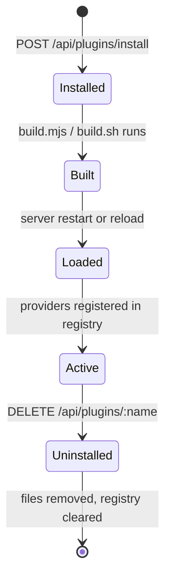
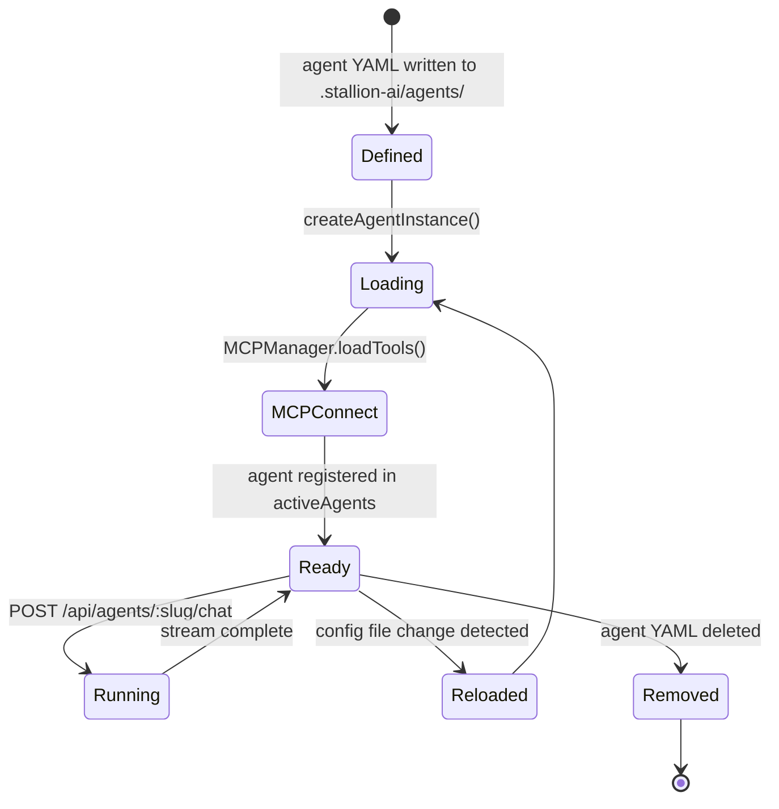
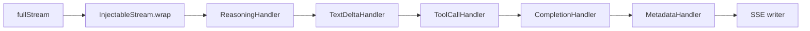

# Stallion Architecture

## System Overview

Stallion is a local-first AI agent system built on Amazon Bedrock. It runs as a self-hosted server that users deploy alongside their own plugins — the core is a generic foundation, and plugins are the product.

**Core/plugin boundary:**
- The core server (`src-server/`) provides the runtime, HTTP API, streaming pipeline, MCP lifecycle, and provider registry. It has no domain-specific logic.
- Plugins are installed into `.stallion-ai/plugins/` and register providers (auth, branding, agent registry, tool registry, settings, onboarding) that the core discovers at startup. Plugins can also ship agents, tools, and UI components.
- The SDK (`packages/sdk/`) is the contract between the core and plugin UIs — plugins import from `@stallion-ai/sdk` and never call the server directly.

This means the core can be upgraded independently of plugins, and plugins can be swapped without touching the runtime.

---

## Architecture Diagram

```mermaid
graph TB
    subgraph Clients
        UI[Web UI / Tauri Desktop]
        CLI[kiro-cli / external CLI]
    end

    subgraph Core Server [:3141]
        RT[StallionRuntime]
        RT --> |mounts| ROUTES[Hono Routes]
        RT --> |manages| AGENTS[Active Agents]
        RT --> |manages| MCP[MCPManager]
        RT --> |manages| ACP[ACPManager]
        RT --> |emits| EB[EventBus]

        ROUTES --> |POST /api/agents/:slug/chat| STREAM[StreamOrchestrator]
        STREAM --> |pipeline| PIPE[StreamPipeline]
        PIPE --> H1[TextDeltaHandler]
        PIPE --> H2[ReasoningHandler]
        PIPE --> H3[ToolCallHandler]
        PIPE --> H4[CompletionHandler]
        PIPE --> H5[MetadataHandler]
    end

    subgraph Plugins [.stallion-ai/plugins/]
        P1[Plugin A]
        P2[Plugin B]
        P1 & P2 --> |register| PROV[Provider Registry]
        PROV --> |auth / branding / registry / settings| RT
    end

    subgraph MCP Servers
        MCP1[stdio process]
        MCP2[HTTP/WS server]
    end

    subgraph Monitoring Stack
        OTEL[OTel Collector :4318]
        PROM[Prometheus :9090]
        GRAF[Grafana :3333]
        JAE[Jaeger :16686]
    end

    subgraph Packages
        SDK[@stallion-ai/sdk]
        CONN[@stallion-ai/connect]
        SHARED[@stallion-ai/shared]
    end

    UI --> |HTTP + SSE| ROUTES
    UI --> SDK
    CLI --> |ACP stdio| ACP
    ACP --> |spawns| CLI

    AGENTS --> |tool calls| MCP
    MCP --> MCP1 & MCP2

    RT --> |OTLP| OTEL
    OTEL --> PROM & JAE
    PROM --> GRAF
```

---

## Component Map

| Component | Location | Description |
|---|---|---|
| `StallionRuntime` | `src-server/runtime/stallion-runtime.ts` | Top-level orchestrator — initializes agents, mounts routes, starts ACP, runs health checks |
| `StreamOrchestrator` | `src-server/runtime/stream-orchestrator.ts` | Creates the `StreamPipeline`, wires elicitation callbacks, writes SSE chunks |
| `StreamPipeline` | `src-server/runtime/streaming/StreamPipeline.ts` | Chains `StreamHandler` instances as async generators; supports abort |
| `MCPManager` | `src-server/runtime/mcp-manager.ts` | Creates `MCPConfiguration` objects, normalizes tool names, manages ref counts |
| `ACPManager` | `src-server/services/acp-bridge.ts` | Spawns external CLI processes via Agent Client Protocol, exposes virtual agents |
| `ConversationManager` | `src-server/runtime/conversation-manager.ts` | Context management and stats for conversations |
| `ToolExecutor` | `src-server/runtime/tool-executor.ts` | Wraps tools with elicitation-based approval gates |
| `ApprovalRegistry` | `src-server/services/approval-registry.ts` | Holds pending tool-approval promises; resolved by the `/tool-approval/:id` endpoint |
| `AgentService` | `src-server/services/agent-service.ts` | CRUD operations for agent config files |
| `MCPService` | `src-server/services/mcp-service.ts` | Service-layer wrapper around MCPManager for route handlers |
| `WorkspaceService` | `src-server/services/workspace-service.ts` | Workspace and workflow file management |
| `SchedulerService` | `src-server/services/scheduler-service.ts` | Cron-based agent invocation scheduling |
| `EventBus` | `src-server/services/event-bus.ts` | In-process pub/sub for SSE fan-out to connected clients |
| `ConfigLoader` | `src-server/domain/config-loader.ts` | Reads/writes agent YAML, app config, ACP config; watches for file changes |
| `FileMemoryAdapter` | `src-server/adapters/file/memory-adapter.ts` | Persists conversations and messages to `.stallion-ai/` on disk |
| `UsageAggregator` | `src-server/analytics/usage-aggregator.ts` | Aggregates token usage from persisted events |
| `BedrockModelCatalog` | `src-server/providers/bedrock-models.ts` | Resolves and validates Bedrock model IDs |
| `InjectableStream` | `src-server/runtime/streaming/InjectableStream.ts` | Wraps `fullStream` to allow out-of-band event injection (e.g. approval requests) |
| Framework Adapter | `src-server/runtime/voltagent-adapter.ts` or `strands-adapter.ts` | Pluggable adapter layer between the runtime and the underlying AI SDK |
| Provider Registry | `src-server/providers/registry.ts` | Singleton registry for all plugin-provided implementations |

---

## Data Flow: Chat Request

```mermaid
sequenceDiagram
    participant UI
    participant Server as POST /api/agents/:slug/chat
    participant ACP as ACPManager
    participant Agent
    participant Pipeline as StreamPipeline
    participant MCP as MCP Server
    participant Bedrock

    UI->>Server: {input, conversationId, userId}
    Server->>Server: resolve agent (or ACP route)
    alt ACP agent
        Server->>ACP: handleChat()
        ACP-->>UI: SSE stream (translated from ACP protocol)
    else local agent
        Server->>Agent: streamText(input, options)
        Agent->>Bedrock: invoke model (streaming)
        Bedrock-->>Agent: token stream
        Agent-->>Pipeline: fullStream (AsyncIterable)
        loop each chunk
            Pipeline->>Pipeline: TextDeltaHandler → ReasoningHandler → ToolCallHandler → CompletionHandler → MetadataHandler
            Pipeline-->>UI: SSE data: {type, ...}
        end
        alt tool call required
            Agent->>MCP: execute tool
            MCP-->>Agent: tool result
            Note over Agent,Pipeline: if not auto-approved, InjectableStream injects<br/>tool-approval-request event; UI responds to<br/>/tool-approval/:id before execution continues
        end
        Server-->>UI: data: [DONE]
    end
```

Key SSE event types emitted during a chat:
- `conversation-started` — new conversation ID (first message only)
- `text-delta` — incremental text token
- `reasoning` — model reasoning/thinking content
- `tool-call` — tool invocation with args
- `tool-result` — tool execution result
- `tool-approval-request` — pauses stream, waits for user approval
- `completion` — final usage stats and finish reason
- `error` — stream-level error

---

## Plugin Lifecycle



**Install** — The plugin directory is copied into `.stallion-ai/plugins/<name>/`. If a `build.mjs` or `build.sh` exists, it runs to produce `dist/`.

**Load** — On startup (or after a reload), `loadPluginProviders()` scans `plugins/`, reads each `plugin.json` manifest, and dynamically imports provider modules. Each provider is registered in the appropriate singleton slot (auth, branding, agentRegistry, etc.).

**Render** — Plugin UI bundles are served from `/api/plugins/:name/dist/:file`. The web UI loads them as ES module chunks. Plugins use `@stallion-ai/sdk` hooks and components — they never call the server directly.

**Uninstall** — The plugin directory is deleted. On next reload, the registry is cleared and rebuilt without the removed plugin. Agents and tools installed by the plugin are also removed.

---

## Agent Lifecycle



**Define** — An agent is a YAML file in `.stallion-ai/agents/<slug>/agent.yaml` (schema: `schemas/agent.schema.json`). It specifies model, prompt, tools, guardrails, and MCP server references.

**Load** — `createAgentInstance()` reads the spec, resolves the Bedrock model, creates a `FileMemoryAdapter`, and delegates to the active framework adapter.

**MCP Connect** — For each `tools.mcpServers` entry, `MCPManager` creates an `MCPConfiguration` (stdio, HTTP, or WebSocket transport), connects, and loads the tool list. Tool names are normalized to avoid collisions.

**Chat** — `agent.streamText()` is called with the user input and conversation context. The result's `fullStream` is piped through the `StreamPipeline` and written as SSE.

**Monitor** — `agent-start` and `agent-complete` events are emitted to `monitoringEvents` and persisted to `.stallion-ai/monitoring/events-<date>.ndjson`. OTel spans and metrics are recorded for each request.

---

## ACP (Agent Communication Protocol)

ACP connects Stallion to external CLI runtimes (e.g. kiro-cli). The `ACPManager` spawns the CLI as a subprocess and communicates over stdio using the `@agentclientprotocol/sdk`.

Each ACP connection exposes:
- **Virtual agents** — the CLI's available modes appear as agents in the Stallion agent list
- **Slash commands** — mode-specific commands surfaced in the chat UI
- **Chat delegation** — `POST /api/agents/:slug/chat` routes to `acpBridge.handleChat()` when the slug belongs to an ACP agent; the response is translated to the same SSE format the UI expects

ACP connections are configured in `.stallion-ai/config/acp.json` and managed via `/acp/connections` CRUD endpoints.

> For full protocol details, see `guides/acp.md` (forthcoming).

---

## Streaming Pipeline

The `StreamPipeline` is a chain of `StreamHandler` instances, each implemented as an async generator. Handlers process the output of the previous handler — zero or more output chunks per input chunk.



| Handler | Responsibility |
|---|---|
| `ReasoningHandler` | Buffers `<thinking>` blocks; emits `reasoning` events; holds all chunks during thinking so injected approval events appear at the right boundary |
| `TextDeltaHandler` | Pass-through for text events (reasoning handler already formats them correctly) |
| `ToolCallHandler` | Augments `tool-call` events with parsed `server` and `tool` fields for UI display |
| `CompletionHandler` | Tracks accumulated text, finish reason, and whether any output was produced |
| `MetadataHandler` | Emits usage stats and monitoring events on stream completion |

The `InjectableStream` wrapper allows the elicitation callback to inject `tool-approval-request` events into the stream at chunk boundaries without modifying the underlying `fullStream`.

Abort is handled via `AbortController` — the pipeline checks the signal before each yielded chunk, and the client disconnect listener calls `abort()`.

---

## Extension Points

| Extension Point | How to Hook In |
|---|---|
| **Auth provider** | Plugin registers `AuthProvider` — controls login, session validation, and user identity |
| **Agent registry** | Plugin registers `AgentRegistryProvider` — supplies the browsable agent catalog |
| **Tool registry** | Plugin registers `ToolRegistryProvider` — supplies the browsable tool/MCP catalog |
| **Branding** | Plugin registers `BrandingProvider` — overrides logo, colors, app name |
| **Settings** | Plugin registers `SettingsProvider` — adds plugin-specific settings UI |
| **Onboarding** | Plugin registers `OnboardingProvider` — controls the first-run flow |
| **MCP tools** | Any stdio/HTTP/WebSocket MCP server can be referenced in an agent's `tools.mcpServers` |
| **ACP connections** | Any CLI that implements the Agent Client Protocol can be connected via `/acp/connections` |
| **Voice providers** | Plugins register `STTProvider`, `TTSProvider`, or `ConversationalVoiceProvider` via `voiceRegistry` (SDK) |
| **Context providers** | Plugins register `MessageContextProvider` via `contextRegistry` (SDK) to inject context into chat messages |
| **Workspace providers** | Plugins register workspace-level data providers via `registerProvider` (SDK) |
| **Scheduler** | Agents can be invoked on a cron schedule via `POST /scheduler/jobs` |

---

## Packages

### `src-server/` — Core Server
The runtime, HTTP API, streaming pipeline, MCP lifecycle, ACP bridge, analytics, telemetry, and all provider interfaces. Runs on Node.js, built with esbuild to `dist-server/index.js`. Exposes a REST + SSE API on port 3141 (configurable).

### `packages/sdk/` — `@stallion-ai/sdk`
The plugin UI contract. Exports React hooks (`useAgents`, `useConversations`, `useSendMessage`, `useToolApproval`, etc.), query factories, API client functions (`streamMessage`, `invoke`, `callTool`), UI primitives (`Button`, `Spinner`, `Pill`), voice/context registries, and workspace provider utilities. Plugins import from here — never from the server directly.

### `packages/connect/` — `@stallion-ai/connect`
Multi-host connection management for mobile and remote scenarios. Exports `ConnectionStore`, `ConnectionsProvider`, `useConnectionStatus`, `useHostUrl`, `QRDisplay`, `QRScanner`, and `ConnectionManagerModal`. Handles server discovery, QR-based pairing, and connection persistence via a pluggable `StorageAdapter`.

### `packages/shared/` — `@stallion-ai/shared`
Build utilities shared between the server and plugin toolchain — primarily `buildPlugin()` and `copyPluginTools()` used by the plugin install flow.

### `packages/cli/` — `@stallion-ai/cli`
The `stallion` CLI binary. Wraps the server startup and provides developer commands.

### `src-ui/` — Web UI
React + Vite frontend. Consumes `@stallion-ai/sdk`. Built to `dist-ui/` and served by the server in production. In development, runs on port 5173 with `VITE_API_BASE` pointing at the server.

### `src-desktop/` — Desktop App
Tauri wrapper around the web UI for native desktop distribution.

---

## Related Docs

- `docs/guides/agents.md` — creating and configuring agents
- `docs/guides/plugins.md` — building and installing plugins
- `docs/reference/api.md` — full HTTP API reference
- `docs/reference/config.md` — app and agent config schemas
- `docs/reference/connect.md` — `@stallion-ai/connect` API
- `docs/reference/shared.md` — `@stallion-ai/shared` API
- `docs/guides/monitoring.md` — OTel, Prometheus, Grafana setup
