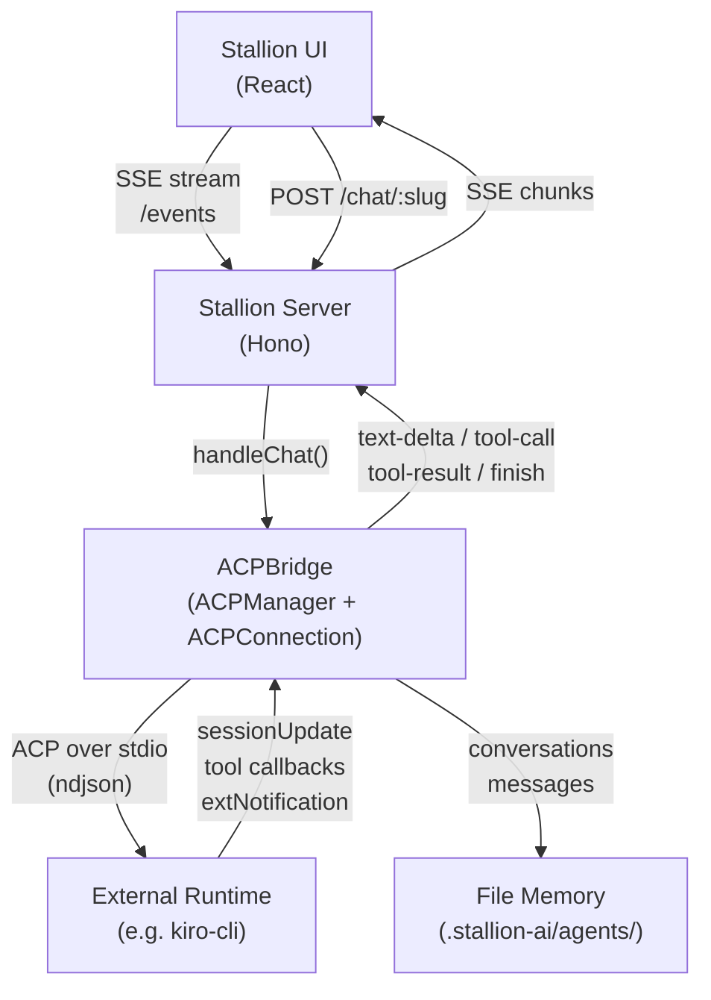

# Agent Communication Protocol (ACP) Guide

ACP connects external agent runtimes to Stallion. It lets Stallion act as a UI and orchestration layer for agents running in separate processes — like `kiro-cli` — without those agents needing to know anything about Stallion's internals.

This guide is for developers who want to connect their own agent runtime to Stallion.

---

## What is ACP?

Stallion is a UI and session management layer. It handles conversations, memory, tool approval, and streaming responses. ACP is the protocol that lets an external agent runtime plug into all of that.

When an ACP connection is active, Stallion:
- Spawns the external runtime as a subprocess (or connects to one)
- Translates ACP protocol events into Stallion's SSE streaming format
- Exposes the runtime's modes as virtual agents in the agent registry
- Proxies slash commands and tool calls through the bridge
- Persists conversation history and session state on behalf of the runtime

The external runtime only needs to implement the [Agent Client Protocol SDK](https://github.com/agentclientprotocol/sdk). It never talks to Stallion's HTTP API directly.

---

## Architecture



The bridge communicates with the runtime over **ndjson on stdio** using the ACP SDK's `ClientSideConnection`. All message translation — from ACP session updates to Stallion's SSE event format — happens inside `ACPConnection`.

---

## Sessions

### Creation

On `start()`, the bridge:

1. Spawns the configured command as a subprocess
2. Calls `connection.initialize()` with `clientCapabilities` (fs read/write, terminal)
3. Scans existing conversation metadata for a previous `acpSessionId`
4. If a previous session ID exists **and** the runtime advertises `loadSession` capability, calls `connection.loadSession()` to restore context
5. Otherwise calls `connection.newSession()` to create a fresh session
6. Extracts available modes and config options from the session result

### Lifecycle

| State | Meaning |
|---|---|
| `disconnected` | Not started or subprocess exited |
| `connecting` | Subprocess spawned, handshake in progress |
| `connected` | Session active, ready to handle prompts |
| `error` | Startup failed |
| `unavailable` | Configured command not found on PATH |

On subprocess exit, the bridge automatically schedules reconnection with exponential backoff (1s → 2s → 4s … up to 30s, max 5 attempts).

### Session Persistence

Each conversation stores `acpSessionId` in its metadata. On reconnect, the bridge scans stored conversations to find the most recent session ID and attempts to resume it. This lets the external runtime restore its context window across Stallion restarts.

---

## Agent Modes

External runtimes advertise **modes** via the `newSession` response:

```json
{
  "sessionId": "abc123",
  "modes": {
    "availableModes": [
      { "id": "chat", "name": "Chat", "description": "Conversational mode" },
      { "id": "agent", "name": "Agent", "description": "Agentic task mode" }
    ],
    "currentModeId": "chat"
  }
}
```

Each mode becomes a **virtual agent** in Stallion's agent registry with slug `{connectionId}-{modeId}`. For a connection with `id: "kiro"` and modes `["chat", "agent"]`, Stallion registers:

- `kiro-chat` — "Chat" agent
- `kiro-agent` — "Agent" agent

When a user sends a message to `kiro-agent`, the bridge calls `connection.setSessionMode({ sessionId, modeId: "agent" })` before forwarding the prompt if the mode has changed.

Virtual agents also surface:
- `model` — current model name from `configOptions`
- `modelOptions` — available models if the runtime provides them
- `supportsAttachments` — from `promptCapabilities.image`
- `icon` — from the connection config

---

## Message Flow

### Regular Prompt

```
User sends message
  → POST /chat/kiro-agent
  → ACPConnection.handleChat()
    → setSessionMode() if mode changed
    → setSessionConfigOption() if model changed
    → connection.prompt({ sessionId, prompt: [...content] })
      → Runtime processes prompt
      → sessionUpdate callbacks fire:
          agent_message_chunk  → SSE: text-delta
          agent_thought_chunk  → SSE: reasoning-delta
          tool_call            → SSE: tool-call
          tool_call_update     → SSE: tool-result
          plan                 → SSE: reasoning-start/delta/end
    → SSE: finish
    → SSE: [DONE]
```

### Input Formats

The bridge accepts two input formats:

**Plain string:**
```json
"What is the capital of France?"
```

**UIMessage array** (with file attachments):
```json
[{
  "id": "msg-1",
  "role": "user",
  "parts": [
    { "type": "text", "text": "Describe this image" },
    { "type": "file", "url": "data:image/png;base64,...", "mediaType": "image/png" }
  ]
}]
```

Images are stripped of their data URL prefix and forwarded to the runtime as `{ type: "image", data: "...", mimeType: "..." }` prompt content.

### SSE Event Types

| Event | When |
|---|---|
| `conversation-started` | First message in a new conversation |
| `text-delta` | Streaming text chunk from the agent |
| `reasoning-delta` | Streaming thought/reasoning chunk |
| `reasoning-start` / `reasoning-end` | Wraps a plan or reasoning block |
| `tool-call` | Agent is invoking a tool |
| `tool-result` | Tool execution completed |
| `tool-approval-request` | Tool requires user approval before running |
| `finish` | Turn complete (`finishReason`: `end_turn` or `cancelled`) |
| `error` | Unrecoverable error during the turn |

---

## Slash Commands

### Discovery

Slash commands are advertised by the runtime through two mechanisms:

**Standard ACP** — via `available_commands_update` session update:
```json
{
  "sessionUpdate": "available_commands_update",
  "availableCommands": [
    { "name": "/clear", "description": "Clear conversation history" },
    { "name": "/compact", "description": "Compact context window", "input": { "hint": "instructions" } }
  ]
}
```

**Kiro extension** — via `_kiro.dev/commands/available` ext notification:
```json
{
  "commands": [
    { "name": "/clear", "description": "Clear history" },
    { "name": "/compact", "description": "Compact context", "input": { "hint": "instructions" } }
  ]
}
```

Both paths populate the same `slashCommands` list. Stallion exposes them at:

```
GET /acp/commands/:slug
```

### Execution

When a user sends a message starting with `/`, the bridge routes it through the `_kiro.dev/commands/execute` extension method instead of `connection.prompt()`:

```json
{
  "sessionId": "abc123",
  "command": "Clear",
  "input": "optional argument"
}
```

The command name is PascalCased (e.g., `/clear` → `"Clear"`). The runtime processes the command and responds via session update notifications, which flow back through the normal SSE stream.

If the extension method fails, the bridge falls back to sending the raw slash command text as a regular prompt.

### Autocomplete

```
GET /acp/commands/:slug/options?q=cle
```

Calls `_kiro.dev/commands/options` on the runtime with the partial command string. Returns an array of completion options. Times out after 3 seconds.

---

## Tool Execution

### Tool Calls (Runtime → Stallion)

When the runtime invokes a tool, it fires a `tool_call` session update. The bridge translates this to a `tool-call` SSE event and tracks the call in `responseParts`:

```
sessionUpdate: tool_call
  toolCallId: "call-abc"
  title: "read_file"
  rawInput: { "path": "/src/index.ts" }

→ SSE: { type: "tool-call", toolCallId: "call-abc", toolName: "read_file", input: {...} }
```

Results arrive via `tool_call_update`:

```
sessionUpdate: tool_call_update
  toolCallId: "call-abc"
  status: "completed"
  content: [{ type: "content", content: { type: "text", text: "file contents..." } }]

→ SSE: { type: "tool-result", toolCallId: "call-abc", output: "file contents..." }
```

Diff content (file edits) is formatted as a markdown diff block:

```
sessionUpdate: tool_call_update
  content: [{ type: "diff", path: "src/foo.ts", oldText: "...", newText: "..." }]

→ SSE: { type: "tool-result", output: "**Modified:** `src/foo.ts`\n```diff\n..." }
```

### Tool Approval (Runtime → User)

When the runtime needs permission before running a tool, it calls back via `requestPermission`. The bridge:

1. Generates an approval ID
2. Emits `tool-approval-request` into the SSE stream
3. Blocks until the user responds via `POST /tool-approval/:approvalId`
4. Maps the user's decision back to the ACP `allow_once` or `reject_once` option

```
requestPermission({ toolCall: { title: "bash", rawInput: { command: "rm -rf ..." } }, options: [...] })
  → SSE: { type: "tool-approval-request", approvalId: "acp-xyz", toolName: "bash", toolArgs: {...} }
  → [user approves/rejects in UI]
  → POST /tool-approval/acp-xyz  { approved: true }
  → returns { outcome: { outcome: "selected", optionId: "allow_once_id" } }
```

### File System Tools (Stallion → Runtime)

The bridge implements the ACP file system callbacks so the runtime can read and write files on the Stallion host:

| Callback | Behavior |
|---|---|
| `readTextFile(path)` | Reads file from disk, returns content |
| `writeTextFile(path, content)` | Writes content to disk |

### Terminal Tools (Stallion → Runtime)

The bridge manages subprocesses on behalf of the runtime:

| Callback | Behavior |
|---|---|
| `createTerminal(command, args, cwd, env)` | Spawns subprocess, returns `terminalId` |
| `terminalOutput(terminalId)` | Returns accumulated stdout+stderr |
| `waitForTerminalExit(terminalId)` | Blocks until process exits, returns exit code |
| `releaseTerminal(terminalId)` | Kills the process |
| `killTerminal(terminalId)` | Sends SIGTERM |

---

## Configuration

### acp.json

ACP connections are configured in `<stallion-home>/config/acp.json`:

```json
{
  "connections": [
    {
      "id": "kiro",
      "name": "Kiro",
      "command": "kiro-cli",
      "args": ["acp"],
      "icon": "🤖",
      "cwd": "/path/to/project",
      "enabled": true
    }
  ]
}
```

| Field | Required | Description |
|---|---|---|
| `id` | ✓ | Unique identifier. Used as the slug prefix for virtual agents. |
| `name` | ✓ | Display name shown in the UI. |
| `command` | ✓ | Executable to spawn. Must be on PATH. |
| `args` | | Arguments passed to the command. |
| `icon` | | Emoji or string shown next to the agent name. Defaults to `🔌`. |
| `cwd` | | Working directory for the subprocess. Defaults to Stallion's cwd. |
| `enabled` | ✓ | Set to `false` to disable without removing the config. |

### Runtime API

Connections can also be managed at runtime via the REST API:

```
GET    /acp/connections          List all connections with live status
POST   /acp/connections          Add a new connection
PUT    /acp/connections/:id      Update a connection (restarts it)
DELETE /acp/connections/:id      Remove and shut down a connection
GET    /acp/status               Get status of all connections
```

### SSE Status Events

The `/events` SSE stream replays ACP status on connect and emits updates as connections change:

```
event: acp:status
data: {
  "connected": true,
  "connections": [
    { "id": "kiro", "status": "connected" }
  ]
}
```

The `agents:changed` event fires whenever virtual agents are added or removed (e.g., after a successful connection).

---

## Troubleshooting

### Connection stays `unavailable`

The configured `command` was not found on PATH. Verify the binary is installed and accessible:

```bash
which kiro-cli
```

If the binary is installed but not on the server's PATH, use an absolute path in `command`.

### Connection stays `connecting` or goes to `error`

Check server logs for `[ACPBridge]` entries. Common causes:

- The subprocess exits immediately — run the command manually to see its output
- The runtime doesn't speak ACP ndjson on stdio — verify it implements the ACP SDK server side
- Protocol version mismatch — the bridge sends `PROTOCOL_VERSION` from the ACP SDK; ensure the runtime supports it

### Modes not appearing as agents

Modes are extracted from the `newSession` response. If the runtime returns an empty `availableModes` array, no virtual agents are registered. Check that your runtime's `newSession` handler returns:

```json
{
  "sessionId": "...",
  "modes": {
    "availableModes": [{ "id": "chat", "name": "Chat" }],
    "currentModeId": "chat"
  }
}
```

### Session not resuming after restart

Session resumption requires:
1. The runtime to advertise `agentCapabilities.loadSession: true` in the `initialize` response
2. At least one conversation with `acpSessionId` in its metadata (set automatically after the first chat)

If the runtime doesn't support `loadSession`, a new session is always created.

### Slash commands not appearing

Commands must be advertised after session creation, either via:
- `available_commands_update` session update (standard ACP)
- `_kiro.dev/commands/available` ext notification (Kiro extension)

Check that your runtime sends one of these after `newSession` completes.

### Tool approval requests not resolving

The bridge blocks the prompt until the user responds at `POST /tool-approval/:approvalId`. If the UI isn't showing the approval dialog, check that the `tool-approval-request` SSE event is being received and handled by the frontend.

### Reconnect loop

If the subprocess keeps exiting and reconnecting, check:
- The subprocess is not crashing on startup (run it manually)
- `maxReconnectAttempts` (5) hasn't been exhausted — after 5 failures the bridge stops retrying and stays in `error` state. Restart Stallion or use `PUT /acp/connections/:id` to trigger a fresh start.
